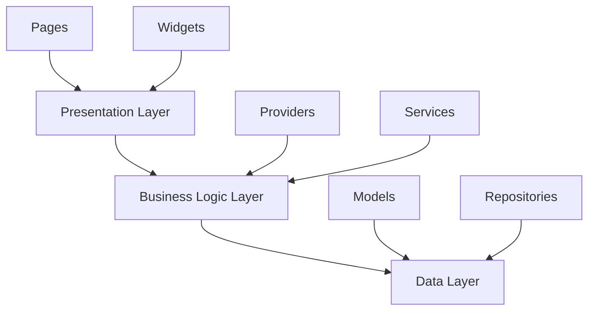

# Flutter Mall 开发指南

本文档为新加入项目的开发者提供详细的开发指南，包括项目架构、开发规范、最佳实践等。

## 📚 目录

- [项目概述](#项目概述)
- [环境准备](#环境准备)
- [项目架构](#项目架构)
- [开发规范](#开发规范)
- [常用命令](#常用命令)
- [最佳实践](#最佳实践)
- [故障排除](#故障排除)
- [学习资源](#学习资源)

## 🎯 项目概述

Flutter Mall是一个现代化的移动购物商城应用，采用Flutter框架开发，支持iOS和Android平台。项目遵循业界最佳实践，代码结构清晰，易于维护和扩展。

### 主要特点

- **跨平台支持** - 一套代码，多端运行
- **现代化架构** - MVVM + Provider状态管理
- **类型安全** - 完整的Dart类型系统
- **响应式UI** - Material Design 3设计语言
- **完整测试** - 单元测试 + 集成测试

## 🛠️ 环境准备

### 必需工具

1. **Flutter SDK 3.8.1+**
   ```bash
   # 检查Flutter版本
   flutter --version
   
   # 检查环境配置
   flutter doctor
   ```

2. **IDE配置**
   - **VS Code** (推荐)
     - Flutter插件
     - Dart插件
     - Error Lens插件
     - GitLens插件
   - **Android Studio**
     - Flutter插件
     - Dart插件

3. **开发工具**
   ```bash
   # 安装FVM（Flutter版本管理）
   dart pub global activate fvm
   
   # 安装代码生成工具
   dart pub global activate build_runner
   ```

### 项目设置

1. **克隆项目**
   ```bash
   git clone https://github.com/your-org/flutter_home_mall.git
   cd flutter_home_mall
   ```

2. **安装依赖**
   ```bash
   flutter pub get
   ```

3. **代码生成**
   ```bash
   dart run build_runner build
   ```

4. **运行项目**
   ```bash
   flutter run -d ios      # iOS模拟器
   flutter run -d android  # Android模拟器
   ```

## 🏗️ 项目架构

### 目录结构详解

```
lib/
├── config/                 # 应用配置
│   └── app_config.dart    # 环境配置、功能开关
├── constants/              # 常量定义
│   ├── app_colors.dart    # 颜色常量
│   └── app_strings.dart   # 字符串常量
├── core/                  # 核心模块
│   ├── exceptions/        # 异常处理
│   │   └── app_exceptions.dart
│   ├── router/           # 路由配置
│   │   └── app_router.dart
│   ├── themes/           # 主题配置
│   │   └── app_theme.dart
│   └── utils/            # 核心工具
│       └── logger.dart
├── models/               # 数据模型
│   ├── api_models.dart   # API模型统一导出
│   ├── product_models.dart
│   ├── user_models.dart
│   └── ...
├── pages/                # 页面组件
│   ├── home_page.dart
│   ├── product_detail_page.dart
│   └── ...
├── providers/            # 状态管理
│   ├── app_state.dart
│   ├── cart_state.dart
│   └── ...
├── services/             # 业务服务
│   └── graphql_service.dart
├── utils/                # 实用工具
│   ├── network_helper.dart
│   └── ...
├── widgets/              # 通用组件
│   ├── product_card.dart
│   └── ...
└── main.dart             # 应用入口
```

### 架构分层



1. **表现层 (Presentation Layer)**
   - **Pages**: 完整的页面组件
   - **Widgets**: 可复用的UI组件

2. **业务逻辑层 (Business Logic Layer)**
   - **Providers**: 状态管理，处理UI状态变化
   - **Services**: 业务服务，处理复杂业务逻辑

3. **数据层 (Data Layer)**
   - **Models**: 数据模型定义
   - **Repositories**: 数据访问抽象层

## 📋 开发规范

### 代码规范

#### 1. 命名规范

```dart
// 类名：PascalCase
class ProductDetailPage extends StatefulWidget {}
class UserRepository {}

// 变量名：camelCase
String userName = 'john';
List<Product> productList = [];

// 常量名：lowerCamelCase
const String apiBaseUrl = 'https://api.example.com';

// 私有成员：下划线前缀
String _privateField;
void _privateMethod() {}

// 文件名：snake_case
product_detail_page.dart
user_repository.dart
```

#### 2. 导入规范

```dart
// Dart库
import 'dart:async';
import 'dart:convert';

// Flutter库
import 'package:flutter/material.dart';
import 'package:flutter/services.dart';

// 第三方包
import 'package:provider/provider.dart';
import 'package:go_router/go_router.dart';

// 项目内部文件
import '../models/product_models.dart';
import '../services/api_service.dart';
```

#### 3. 注释规范

```dart
/// 商品详情页面
/// 
/// 显示商品的详细信息，包括图片、价格、规格等
/// 支持用户选择规格并加入购物车
class ProductDetailPage extends StatefulWidget {
  /// 构造函数
  /// 
  /// [productId] 商品ID，必填参数
  const ProductDetailPage({
    super.key,
    required this.productId,
  });

  /// 商品ID
  final String productId;

  @override
  State<ProductDetailPage> createState() => _ProductDetailPageState();
}
```

### 状态管理规范

#### Provider使用模式

```dart
// 1. 定义State类
class CartState extends ChangeNotifier {
  List<CartItem> _items = [];
  
  List<CartItem> get items => List.unmodifiable(_items);
  
  /// 添加商品到购物车
  void addItem(Product product) {
    // 业务逻辑
    _items.add(CartItem.fromProduct(product));
    notifyListeners();
  }
}

// 2. 在main.dart中注册
MultiProvider(
  providers: [
    ChangeNotifierProvider(create: (_) => CartState()),
  ],
  child: MyApp(),
)

// 3. 在Widget中使用
class CartPage extends StatelessWidget {
  @override
  Widget build(BuildContext context) {
    return Consumer<CartState>(
      builder: (context, cartState, child) {
        return ListView.builder(
          itemCount: cartState.items.length,
          itemBuilder: (context, index) {
            return CartItemWidget(item: cartState.items[index]);
          },
        );
      },
    );
  }
}
```

### API调用规范

```dart
class ApiService {
  /// 获取商品列表
  /// 
  /// 返回商品列表，如果请求失败会抛出异常
  static Future<List<Product>> getProducts() async {
    try {
      final result = await GraphQLService.client.query(
        QueryOptions(document: gql(getProductsQuery)),
      );
      
      if (result.hasException) {
        throw NetworkException.fromGraphQLException(result.exception!);
      }
      
      final List<dynamic> data = result.data?['products'] ?? [];
      return data.map((json) => Product.fromJson(json)).toList();
    } catch (e) {
      ExceptionHandler.logException(e);
      rethrow;
    }
  }
}
```

### 错误处理规范

```dart
// 1. 在Service层处理并重新抛出
Future<User> login(String username, String password) async {
  try {
    // API调用
    final result = await _makeApiCall();
    return User.fromJson(result.data);
  } on NetworkException {
    rethrow; // 重新抛出已知异常
  } catch (e) {
    throw AuthException.loginFailed; // 转换为业务异常
  }
}

// 2. 在Provider中捕获并设置错误状态
void login(String username, String password) async {
  _error = null;
  _isLoading = true;
  notifyListeners();
  
  try {
    _user = await AuthService.login(username, password);
    _isLoggedIn = true;
  } catch (e) {
    _error = ExceptionHandler.handleException(e);
  } finally {
    _isLoading = false;
    notifyListeners();
  }
}

// 3. 在UI中显示错误
Consumer<AuthState>(
  builder: (context, authState, child) {
    if (authState.hasError) {
      return ErrorWidget(message: authState.error!);
    }
    return LoginForm();
  },
)
```

## 🔧 常用命令

### 开发命令

```bash
# 运行应用
flutter run                    # 调试模式
flutter run --release         # 发布模式
flutter run -d chrome        # Web平台

# 代码分析
flutter analyze               # 静态分析
dart format lib/ test/       # 代码格式化

# 测试
flutter test                  # 运行所有测试
flutter test --coverage     # 生成覆盖率报告

# 构建
flutter build apk            # Android APK
flutter build ios           # iOS应用
flutter build web           # Web应用

# 清理
flutter clean               # 清理构建缓存
flutter pub get             # 重新获取依赖
```

### 代码生成

```bash
# 生成代码（如果使用了build_runner）
dart run build_runner build

# 监听文件变化自动生成
dart run build_runner watch

# 清理生成的代码
dart run build_runner clean
```

## 💡 最佳实践

### 1. Widget组织

```dart
// 好的做法：将复杂Widget拆分为更小的组件
class ProductCard extends StatelessWidget {
  const ProductCard({super.key, required this.product});
  
  final Product product;
  
  @override
  Widget build(BuildContext context) {
    return Card(
      child: Column(
        children: [
          _buildImage(),
          _buildInfo(),
          _buildActions(),
        ],
      ),
    );
  }
  
  Widget _buildImage() {
    return CachedNetworkImage(
      imageUrl: product.imageUrl,
      placeholder: (context, url) => const ShimmerWidget(),
      errorWidget: (context, url, error) => const Icon(Icons.error),
    );
  }
  
  Widget _buildInfo() {
    return Padding(
      padding: const EdgeInsets.all(12),
      child: Column(
        crossAxisAlignment: CrossAxisAlignment.start,
        children: [
          Text(product.name, style: Theme.of(context).textTheme.titleMedium),
          Text('¥${product.price}', style: AppTextStyles.price),
        ],
      ),
    );
  }
  
  Widget _buildActions() {
    // 构建操作按钮
  }
}
```

### 2. 资源管理

```dart
// 图片资源统一管理
class AppImages {
  static const String logo = 'assets/images/logo.png';
  static const String placeholder = 'assets/images/placeholder.png';
  
  // 网络图片缓存配置
  static Widget cachedImage(String url) {
    return CachedNetworkImage(
      imageUrl: url,
      placeholder: (context, url) => Image.asset(placeholder),
      errorWidget: (context, url, error) => const Icon(Icons.error),
      fadeInDuration: const Duration(milliseconds: 300),
    );
  }
}
```

### 3. 性能优化

```dart
// 使用const构造函数
const Text('静态文本');

// 避免在build方法中创建对象
class MyWidget extends StatelessWidget {
  // 好：作为类成员
  static const EdgeInsets padding = EdgeInsets.all(16);
  
  @override
  Widget build(BuildContext context) {
    return Container(
      padding: padding, // 重用对象
      child: const Text('内容'),
    );
  }
}

// 使用ListView.builder处理长列表
ListView.builder(
  itemCount: items.length,
  itemBuilder: (context, index) {
    return ListTile(
      title: Text(items[index].title),
    );
  },
)
```

### 4. 调试技巧

```dart
// 使用debugPrint而不是print
debugPrint('调试信息：$variable');

// 使用断言进行调试
assert(productId.isNotEmpty, '商品ID不能为空');

// 使用Logger系统
final Logger _logger = Logger.forClass(ProductService);
_logger.info('获取商品列表', {'count': products.length});
```

## 🔍 故障排除

### 常见问题

#### 1. 依赖冲突

```bash
# 清理依赖
flutter clean
flutter pub get

# 查看依赖树
flutter pub deps
```

#### 2. 构建失败

```bash
# 清理构建缓存
flutter clean
cd ios && rm -rf Pods && pod install  # iOS
cd android && ./gradlew clean         # Android
```

#### 3. 热重载不工作

```bash
# 重启调试会话
r  # 热重载
R  # 热重启
q  # 退出
```

#### 4. 网络连接问题

- 检查模拟器网络设置
- 确认API端点可访问
- 查看应用内调试页面

### 调试工具

1. **Flutter Inspector** - UI层级查看
2. **Performance Overlay** - 性能监控
3. **Debug Page** - 应用内调试工具
4. **Logger System** - 分级日志记录

## 📚 学习资源

### 官方文档

- [Flutter官方文档](https://flutter.dev/docs)
- [Dart语言指南](https://dart.dev/guides)
- [Material Design 3](https://m3.material.io/)

### 推荐教程

- [Flutter实战](https://book.flutterchina.club/)
- [Flutter最佳实践](https://docs.flutter.dev/development/data-and-backend/state-mgmt/options)
- [Provider状态管理](https://pub.dev/packages/provider)

### 社区资源

- [Flutter中文网](https://flutterchina.club/)
- [Flutter社区](https://flutter.cn/)
- [GitHub Flutter Samples](https://github.com/flutter/samples)

## 🎯 下一步

完成环境搭建后，建议按以下顺序学习：

1. **熟悉项目结构** - 浏览各个目录，理解代码组织
2. **运行示例** - 启动应用，体验功能
3. **阅读核心代码** - 从main.dart开始，理解应用流程
4. **修改简单功能** - 尝试修改UI文本、颜色等
5. **添加新功能** - 按照开发流程添加新的功能模块

## 💬 获取帮助

遇到问题时，可以通过以下方式获取帮助：

1. **查看文档** - 首先查阅本指南和官方文档
2. **查看代码** - 查看类似功能的实现代码
3. **运行调试** - 使用调试工具定位问题
4. **寻求帮助** - 向团队成员或社区求助

---

欢迎加入Flutter Mall项目开发！如有任何问题，请及时沟通。 