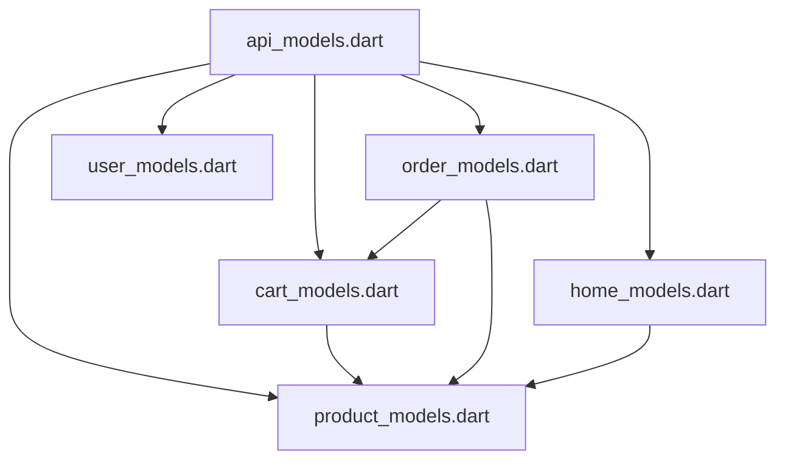

# API 模型模块化架构

本目录包含了应用中所有的数据模型，按照功能域进行模块化拆分，便于维护和管理。

## 📁 文件结构

```
models/
├── api_models.dart          # 统一导出文件
├── product_models.dart      # 商品相关模型
├── cart_models.dart         # 购物车相关模型
├── order_models.dart        # 订单相关模型
├── user_models.dart         # 用户相关模型
├── home_models.dart         # 首页数据相关模型
└── README.md               # 本文档
```

## 🎯 模块说明

### 1. api_models.dart - 统一导出
统一导出所有模型，其他文件只需导入此文件即可使用所有模型：
```dart
import '../models/api_models.dart';
```

### 2. product_models.dart - 商品模型
包含商品相关的所有数据模型：
- `Product` - 商品基础信息
- `ProductDetail` - 商品详细信息
- `ProductSpec` - 商品规格
- `ProductSku` - 商品SKU
- `ProductService` - 商品服务信息
- `ProductReview` - 商品评价

### 3. cart_models.dart - 购物车模型
包含购物车相关的数据模型：
- `CartCount` - 购物车数量统计
- `CartItem` - 购物车项目

### 4. order_models.dart - 订单模型
包含订单系统相关的所有模型：
- `OrderStatus` - 订单状态枚举
- `PaymentMethod` - 支付方式枚举
- `OrderItem` - 订单商品项
- `ShippingAddress` - 收货地址
- `Order` - 订单信息
- `CreateOrderRequest` - 创建订单请求

### 5. user_models.dart - 用户模型
包含用户和认证相关的模型：
- `User` - 用户信息
- `AuthResponse` - 认证响应
- `LoginInput` - 登录输入

### 6. home_models.dart - 首页模型
包含首页展示相关的数据模型：
- `BannerItem` - 轮播图
- `Category` - 商品分类
- `TrendingItem` - 热门项目
- `Recommendation` - 推荐内容
- `Advertisement` - 广告
- `HomeData` - 首页数据聚合

## 🔗 模块依赖关系



### 依赖说明：
- `cart_models.dart` 依赖 `product_models.dart` (CartItem包含Product)
- `order_models.dart` 依赖 `product_models.dart` 和 `cart_models.dart`
- `home_models.dart` 依赖 `product_models.dart` (推荐包含Product列表)

## 📝 使用指南

### 基本使用
```dart
// 推荐方式：导入统一文件
import '../models/api_models.dart';

// 可以使用所有模型
Product product = Product.fromJson(json);
CartItem cartItem = CartItem.fromJson(json);
Order order = Order.fromJson(json);
```

### 按需导入（特殊情况）
```dart
// 如果只需要特定模型，可以单独导入
import '../models/product_models.dart';
import '../models/cart_models.dart';
```

## ✨ 模块化优势

### 1. **代码组织清晰**
- 按功能域分离，职责单一
- 文件大小合理，便于维护

### 2. **依赖关系明确**
- 模块间依赖清晰可见
- 避免循环依赖

### 3. **团队协作友好**
- 不同开发者可以并行维护不同模块
- 减少代码冲突

### 4. **测试便利**
- 可以针对特定模块编写单元测试
- 测试覆盖更精确

### 5. **扩展性强**
- 新增功能时可以创建新模块
- 不影响现有模块

## 🚀 最佳实践

### 1. 新增模型
```dart
// 1. 在对应模块文件中添加新模型
// 2. 在api_models.dart中确保正确导出
export 'new_module_models.dart';
```

### 2. 跨模块引用
```dart
// 通过import明确声明依赖关系
import 'product_models.dart';
import 'cart_models.dart';
```

### 3. 命名规范
- 文件名：`[功能域]_models.dart`
- 类名：使用Pascal命名法
- 属性名：使用camel命名法

### 4. 文档维护
- 每个模型都应有清晰的注释
- 更新模型时同步更新文档
- 保持README的时效性

## 🔄 版本历史

- **v1.0** - 初始模块化拆分
  - 将单文件989行代码拆分为5个功能模块
  - 建立清晰的依赖关系
  - 创建统一导出机制 